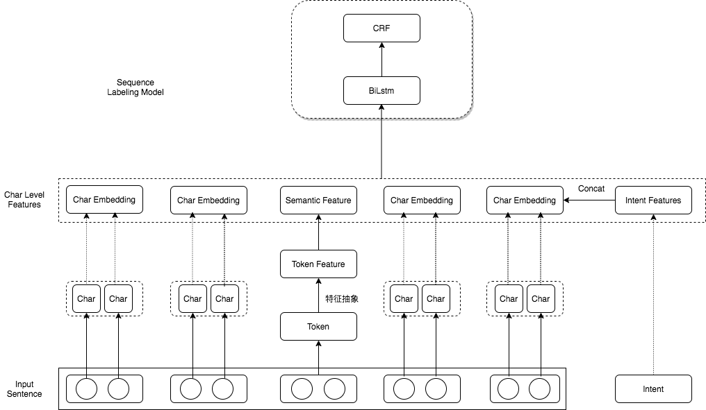

## 一、项目背景：

槽位提取作为NLU链路的重要一环，是用户话术的意图执行，指令下发的重要前置模块。我们研究过弱监督、无监督或集成方案，此Repo是利用深度学习设计的一套方案，重点在于提升语料泛化及对生词（OOV）的识别能力。

## 二、方案：

### 2.1 思路：

常规的NLP方案中，对语料的依赖性很高，当句子中出现生词，哪怕能够记录词的position信息，依然难以保证正确推理，此时只能通过新增语料、更新模型的来增强系统的泛化能力，此方法十分笨重，且耗时耗力。

本Repo的方案不依赖语料，不依赖模型，仅依靠手动维护生词列表，即可对包含“生词”的句子，给出正确的识别结果。

### 2.2 流程：

* 模型结构不是本Repo的重点，方案对了，模型的差异并不大。

### 2.3 效果演示：

#### 2.3.1 泛化能力

#### 2.3.2 同义词识别能力

